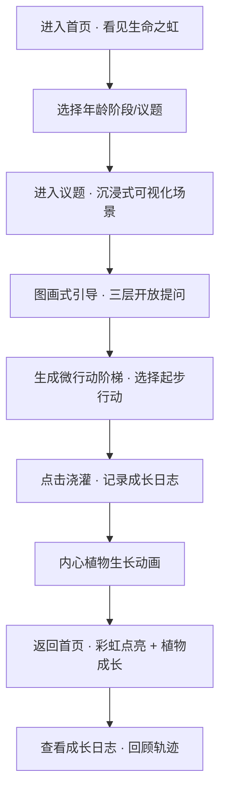

# 生命之虹 · 成果式议题教练 — 产品需求文档 (PRD)

## 1. 产品概述

「生命之虹」是一款基于 Web 的生命教练式成长陪伴应用，以 16 色彩虹隐喻人生四个阶段的成长议题，通过"土壤浇灌·内心植物成长"的视觉化隐喻，引导用户从微行动出发，逐步实现各阶段的人生成果。

- **核心价值**：将玛丽莲·阿特金森《流动·教练的核心》的教练方法论产品化，让每个人都能在对话式体验中获得自我觉察与行动动力
- **目标用户**：20-60+ 岁所有处于人生探索期、拓展期、深化期、圆融期的成长型用户
- **市场定位**：对话即成长，口袋里的生命流动导师

## 2. 核心功能

### 2.1 用户角色
| 角色 | 注册方式 | 核心权限 |
|------|----------|----------|
| 成长者 | 无需注册（本地存储） | 浏览彩虹议题、参与图画引导、打卡浇灌、查看成长日志 |

### 2.2 功能模块
1. **首页彩虹导航**：16 色生命之虹交互式图谱，四个年龄段分组，点击进入对应议题
2. **议题可视化场景**：16 道议题各有专属的图画式引导场景（海滩、树木、老井、河流等隐喻）
3. **图画式引导 + 开放式提问**：每个议题配意象画面 + 3 层递进式开放问题 + 微行动阶梯
4. **打卡浇灌系统**：每日打卡=给内心植物浇水，连续浇灌触发成长动画（萌芽→长叶→开花→结果）
5. **成长日志**：记录每次浇灌的议题、心情、行动承诺，时间线展示成长轨迹
6. **植物成长可视化**：以一棵内心植物的生长状态整体呈现用户的累计成长度

### 2.3 页面详情
| 页面名称 | 模块名称 | 功能描述 |
|----------|----------|----------|
| 首页（彩虹入口） | 彩虹图谱导航 | 16 道弧形色带组成半圆彩虹，悬停显示议题名，点击进入议题详情 |
| 首页（彩虹入口） | 内心植物概览 | 页面底部展示当前植物成长状态 + 连续浇灌天数 |
| 首页（彩虹入口） | 阶段切换器 | 四个年龄段胶囊按钮，切换高亮对应色带 |
| 议题详情页 | 专属可视化场景 | 每个议题独特的 SVG/Canvas 动态意象画面 |
| 议题详情页 | 图画式引导文案 | 场景描述 + 3 层递进开放式问题 |
| 议题详情页 | 微行动阶梯 | 本周/本月/本季/本年四级行动建议，可勾选"我要开始" |
| 议题详情页 | 浇灌打卡按钮 | 一键浇灌，记录本次成长，触发植物生长动画 |
| 成长日志页 | 时间线日志 | 按日期倒序展示所有浇灌记录，含议题、心情、行动 |
| 成长日志页 | 植物成长展示 | 大尺寸内心植物 + 成长数据统计（总浇灌次数、连续天数、覆盖议题数） |
| 成长日志页 | 彩虹点亮进度 | 16 色带根据浇灌次数点亮，展示整体成长地图 |

## 3. 核心流程

**用户主路径**：进入 → 被彩虹吸引 → 选择当下共鸣的议题 → 沉浸画面 + 自我对话 → 选择一个微行动 → 打卡浇灌 → 看见植物生长 → 持续回访

## 4. 用户界面设计

### 4.1 设计风格
- **整体调性**：有机自然 · 流动温暖 · 治愈系质感
- **主色**：土壤棕褐色系 (#5D4037) 为底，彩虹 16 色为内容主视觉
- **辅色**：植物绿 (#4CAF50) 贯穿成长线，暖米色背景 (#FFF8E1)
- **按钮风格**：圆润胶囊按钮，带柔和阴影，hover 有微弹动
- **字体**：标题用衬线体（Source Serif Pro / Noto Serif SC）营造书卷感；正文用圆体/无衬线（Noto Sans SC）保证可读性
- **布局风格**：卡片式 + 大留白 + 不对称布局，重要元素打破网格
- **图标风格**：线性手绘感图标，配合植物/自然主题 emoji

### 4.2 页面设计概览
| 页面名称 | 模块名称 | UI 元素 |
|----------|----------|---------|
| 首页 | 彩虹图谱 | 16 道渐变色带组成上半圆，底部土壤层 + 内心植物，色带悬停发光 |
| 首页 | 阶段切换 | 四个圆角胶囊横排，选中态填充对应阶段主题色 |
| 议题详情页 | 可视化场景 | 全屏 SVG 动态意象（海滩/树/井/河等），随滚动渐进揭示 |
| 议题详情页 | 引导提问 | 打字机效果逐行出现，每行问题可点击展开"我的回答" |
| 议题详情页 | 微行动阶梯 | 四级台阶式卡片，从矮到高，可勾选 |
| 成长日志页 | 时间线 | 左侧植物茎干为时间轴，右侧卡片式日志 |
| 成长日志页 | 彩虹点亮 | 小型彩虹图谱，已浇灌议题高亮闪烁 |

### 4.3 响应式
- 桌面端优先设计（1280px+），适配平板与移动端
- 移动端彩虹图谱改为纵向色带列表，植物展示简化
- 触摸优化：按钮最小 44px 点击区，滑动切换议题

### 4.4 动效重点
- 页面加载：彩虹色带从两端向中间依次点亮（staggered reveal）
- 浇灌动画：水滴从上方落下 → 土壤吸收 → 植物轻微摇曳生长
- 议题切换：场景淡入淡出 + 视差滚动感
- 打卡成功：花瓣/光点飘散粒子效果
