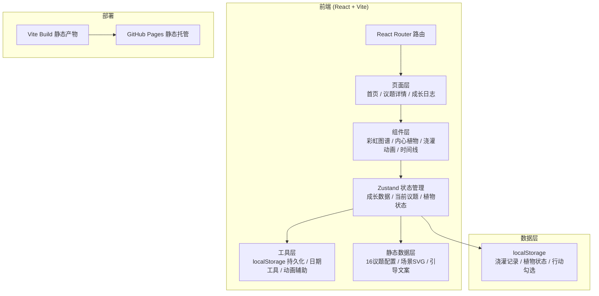

# 生命之虹 · 技术架构文档

## 1. 架构设计



## 2. 技术说明

- **前端框架**：React@18 + TypeScript + Vite
- **样式方案**：TailwindCSS@3 + CSS 变量主题系统
- **状态管理**：Zustand
- **路由**：react-router-dom
- **图标**：lucide-react
- **动画**：CSS keyframes + framer-motion（轻量场景过渡）
- **数据持久化**：localStorage（无需后端）
- **部署方式**：GitHub Pages 静态托管
- **后端**：无（纯前端静态应用）

## 3. 路由定义

| 路由 | 用途 |
|------|------|
| `/` | 首页 — 生命之虹导航 + 内心植物概览 |
| `/topic/:id` | 议题详情页 — 可视化场景 + 引导提问 + 微行动 + 浇灌 |
| `/journal` | 成长日志页 — 时间线 + 植物状态 + 彩虹点亮进度 |

## 4. 数据模型

### 4.1 议题数据 (静态)
```typescript
interface Topic {
  id: number;          // 1-16
  title: string;       // 议题名称
  stage: 'youth' | 'middle' | 'mature' | 'wisdom';
  ageRange: string;    // "20-30岁" 等
  color: string;       // 彩虹色值
  scene: 'beach' | 'tree' | 'well' | 'river' | 'mountain' | 'garden';
  imagery: string;     // 图画式引导文字
  questions: string[]; // 3层开放式问题
  actions: {
    weekly: string;
    monthly: string;
    quarterly: string;
    yearly: string;
  };
}
```

### 4.2 成长记录 (本地存储)
```typescript
interface WateringRecord {
  id: string;
  topicId: number;
  date: string;         // ISO 日期
  mood?: string;        // 心情标签
  reflection?: string;  // 反思文字
  selectedAction?: 'weekly' | 'monthly' | 'quarterly' | 'yearly';
}

interface PlantState {
  stage: 'seed' | 'sprout' | 'leaf' | 'flower' | 'fruit';
  totalWaterings: number;
  streak: number;       // 连续浇灌天数
  lastWaterDate: string | null;
  unlockedTopics: number[];
}
```

### 4.3 Zustand Store
```typescript
interface GrowthStore {
  plant: PlantState;
  records: WateringRecord[];
  water: (topicId: number, data?: Partial<WateringRecord>) => void;
  loadFromStorage: () => void;
}
```

## 5. 项目结构

```
src/
├── components/
│   ├── RainbowArc/          # 16色彩虹图谱组件
│   ├── InnerPlant/          # 内心植物组件（多种生长状态）
│   ├── WateringButton/      # 浇灌按钮 + 水滴动画
│   ├── TopicScene/          # 议题可视化场景（SVG）
│   ├── GuidedQuestions/     # 引导提问组件
│   ├── ActionLadder/        # 微行动阶梯
│   ├── JournalTimeline/     # 日志时间线
│   └── StageTabs/           # 阶段切换标签
├── pages/
│   ├── Home.tsx             # 首页
│   ├── Topic.tsx            # 议题详情页
│   └── Journal.tsx          # 成长日志页
├── store/
│   └── useGrowthStore.ts    # Zustand 状态管理
├── data/
│   └── topics.ts            # 16议题数据
├── utils/
│   ├── storage.ts           # localStorage 工具
│   └── date.ts              # 日期工具
├── App.tsx
├── main.tsx
└── index.css
```

## 6. 部署方案

1. `npm run build` 生成 `dist/` 静态产物
2. 使用 `gh-pages` 或 GitHub Actions 部署到 GitHub Pages
3. 配置仓库 `Settings → Pages → Deploy from a branch`
4. 自定义域名可选（默认 username.github.io/repo-name）
